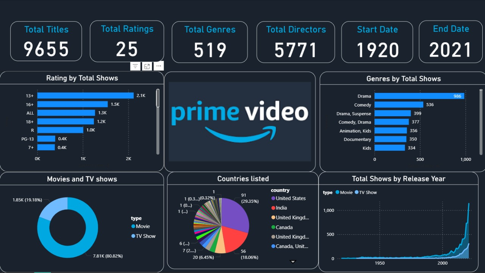

# 🎬 Prime Video Dashboard — Power BI Project

This project is a Power BI dashboard that analyzes Amazon Prime Video's content data. It explores patterns across genres, ratings, countries, and release years using interactive visuals and KPIs.

## 📊 Dashboard Features

- ✅ Total Titles, Ratings, Genres, and Directors
- 📅 Content range from 1920 to 2021
- 🎭 Genre distribution by total shows
- 🌎 Country-wise listing of shows and movies
- 🎬 Rating classification (13+, R, PG-13, etc.)
- 📈 Release year trend for movies vs TV shows
- 🔄 Movie vs TV Show ratio

## 🛠 Tools Used

- Power BI Desktop
- Power Query (ETL and transformation)
- DAX (calculated fields and measures)

## 📁 Files Included

- `prime dashboard.pbix` – Power BI report file
- `primevideo-dashboard.jpg` – Dashboard screenshot
- `README.md` – Project overview and details

## 🖼 Dashboard Preview

## 🚀 How to Use

1. Clone or download this repo
2. Open `prime dashboard.pbix` in Power BI Desktop
3. Interact with filters, visuals, and slicers

## 📌 About This Project

This is a portfolio project to showcase Power BI skills, including data modeling, visual design, and storytelling with data. Ideal for recruiters or anyone interested in streaming content analytics.

---

